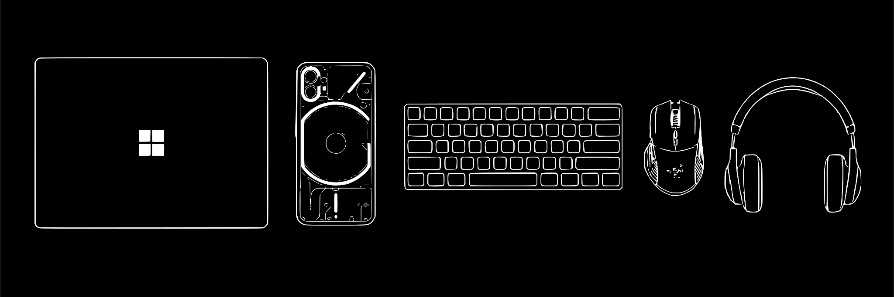

  

<h1 align="center" style="border: none; font-size: 2.5rem; margin-bottom: 0;">
  Hi  I'm Bharath Ajjarapu
</h1>

<b>About Me</b>
  
🌍 I'm based in Hyderabad  
🖥️ See my portfolio [here](http://bharathajjarapu.github.io/bharathajjarapu)  
🚀 Currently working on [r1Chat](http://github.com/bharathajjarapu/r1Chat)  
🧠 Learning Web Development and AI  
✉️ Contact me at [bharathajjarapu@pm.me](mailto:bharathajjarapu@pm.me)  

### 

  
  
  
  
  
  
  

###

  
  
  
  
  
  
  
  
  
  
  

###

  
  
  
  
  
  
  
  
  
  
  
  
  
  
  
  
  

###

  
  
    
    
  
  

###

